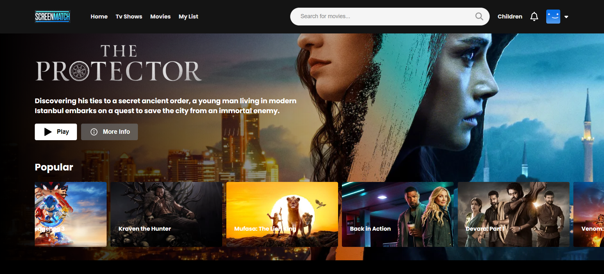

# Screenmatch-project

  ## Table of Contents
  
  - [Description](#description)
  - [Installation](#installation)
  - [Usage](#usage)
  - [License](#license)
  - [Contributing](#contributing)
  - [Tests](#tests)
  - [Questions](#questions)

  ## Description
  
  A website built with React.js .
  
  

  ## Preview

  

  ## Usage

  

  ## License

  This application is covered under the  license.

  ## Contributing

  

  ## Tests

  

  ## Questions

  For additional questions, please contact mateus.oliveira.uk@gmail.com. Visit my [GitHub profile](https://github.com/Mateusuk) to see more of my work.
  
  

